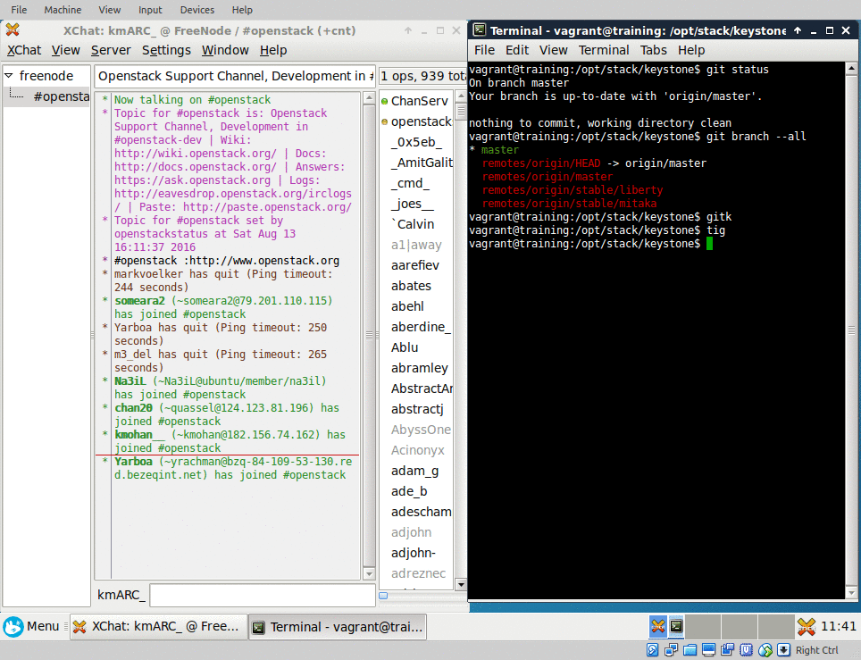

OpenStack Upstream Institute Virtual Environment
================================================

[bit.ly/training-vm](http://bit.ly/training-vm)
-----------------------------------------------

Introduction
------------

### What's this?

A Virtual Machine that has installed in it software what you need to start
hacking OpenStack. If you're coming to the [Upstream
Institute](http://docs.openstack.org/upstream-training/) two days before
[OpenStack Summit](https://www.openstack.org/summit/) starts, you are at the
right place.

### What do I need?

* 5GB of **free** RAM (so at least 8GB in your laptop)
* Recent CPU with at least 4 cores
* 10GB disk space
* [VirtualBox](https://www.virtualbox.org/)

### What do I want?

| A prebuilt image                        | I want to build myself             |
| ----------------                        | ----------------------             |
| Takes 15 minutes                        | Takes 45-60 minutes                |
| [Instructions](#using-a-prebuilt-image) | [Instructions](#building-your-own) |
| [Download image][image] (2GB)           |                                    |

[image]: https://github.com/kmARC/openstack-training-virtual-environment/releases/download/v2017.01/upstream-training-v2017.01.ova
[ova-import-help]: README-virtualbox-import.md

Instructions
------------

### Using a prebuilt image

1. Set up VirtualBox
2. Download the [pre-built image][image]
3. Import the `ova` file (`File` -> `Import appliance...`) (More details to import on Windows are [here][ova-import-help].)
4. Start up the VM
5. Open a terminal and start devstack
    ``` bash
    cd /opt/devstack
    ./stack.sh
    ```
    This step takes about 10 minutes, it needs an internet connection,
    however the expected downloaded data stays low if using a fresh enough
    appliance.
6. To lower the memory consumption, run `optimize-memory` which configures
   horizon, keystone and mysql to use less memory.

### Building your own

1. Set up VirtualBox
2. Set up Vagrant
3. `git clone https://github.com/kmARC/openstack-training-virtual-environment`
4. `cd openstack-training-virtual-environment`
5. `vagrant up`
6. `vagrant reload`
7. `vagrant ssh`

Follow instructions [as for the prebuilt image](#using-a-prebuilt-image)

### Roll your own image

Essentially the same procedure, with exporting an ova archive at the end which
then can be distributed and easily import into VirtualBox

`./create-training-box.sh` is a handy tool that sets up everything with Vagrant
and then creates the distributable box file.

#### Requirements

* [libssl098:i386] is required for vmware vdiskmanager (shrink disks)

    ```bash
    wget http://security.ubuntu.com/ubuntu/ubuntu/pool/universe/o/openssl098/libssl0.9.8_0.9.8o-7ubuntu4_i386.deb
    sudo dpkg -i libssl0.9.8_0.9.8o-7ubuntu4_i386.deb
    ```

[vmvare-vdiskmanager]: https://kb.vmware.com/selfservice/viewAttachment.do?attachID=1023856-vdiskmanager-linux.7.0.1.zip&documentID=1023856
[libssl098:i386]: http://security.ubuntu.com/ubuntu/ubuntu/pool/universe/o/openssl098/

### Learn how to easily set up devstack

* [install-base.sh](install-base.sh) and 
  [install-devstack.sh](install-devstack.sh) - commands used during provisioning
* [files/](files/) - configuration files copied into the vm

Getting around in the VM
------------------------

After booting up the virtual machine, start setting up devstack. It takes around
10 minutes to finish, until then you can get familiar with the environment the
VM provides you with.

To set up an OpenStack installation with devstack, open a terminal and run:

```bash
/opt/devstack/stack.sh && optimize-memory
```

The four main software you will be using from the desktop during the training
are
* a browser (Firefox)
* a terminal emulator
* a text editor (Geany, vim)
* an IRC client (HexChat)

The browser already contains a couple of handy bookmarks on the bookmark bar.
This document can be reached via the **VM Help** bookmark. When `stack.sh`
finished running, you can open the OpenStack Horizon Dashboard using the
**DevStack** bookmark.

DevStack install OpenStack software to `/opt/stack`. You can edit these files
using you preferred editor of choice. You can install any software from the
Ubuntu repoistories using the default `ubuntu` user (password: `openstack`,
however no password needed for sudo).

To log in to IRC, HexChat is set up for you. Please make sure that you replace the
default user `ubuntu` upon first start before logging in to Freenode channels.

The installed OpenStack cloud is capable of running virtual machines. However,
please keep in mind, due to the significant memory requirements of running a VM
your environment may not be capable to perform this task. Also note that the
default security groups are not modified, so if you want to ping or SSH into
your VM, you need to add the correct security rules (ICMP In/Egress from all,
SSH ingress from all). Also beware that sometimes Horizon logs you in into the
wrong project. To use the private networking by default, you need to log in as
the default `demo` user (password: `openstack`) and select `demo` as project.

Screenshots
-----------

Devstack running


Geany with keystone code loaded


git and HexChat


License
-------
MIT

